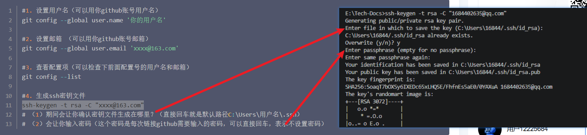
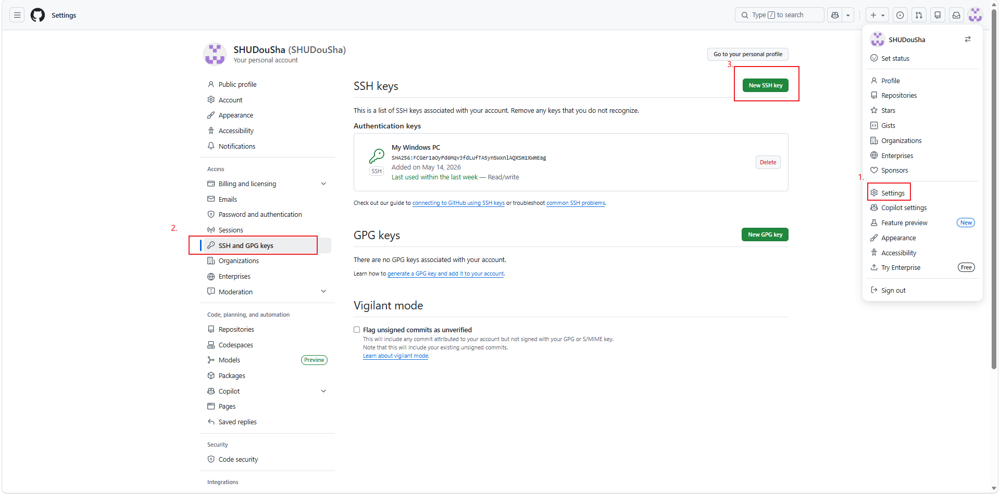
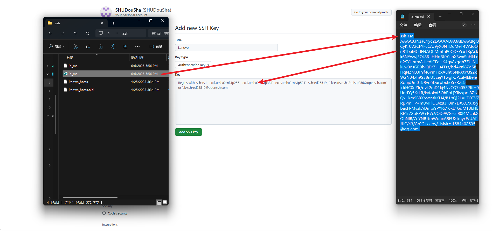
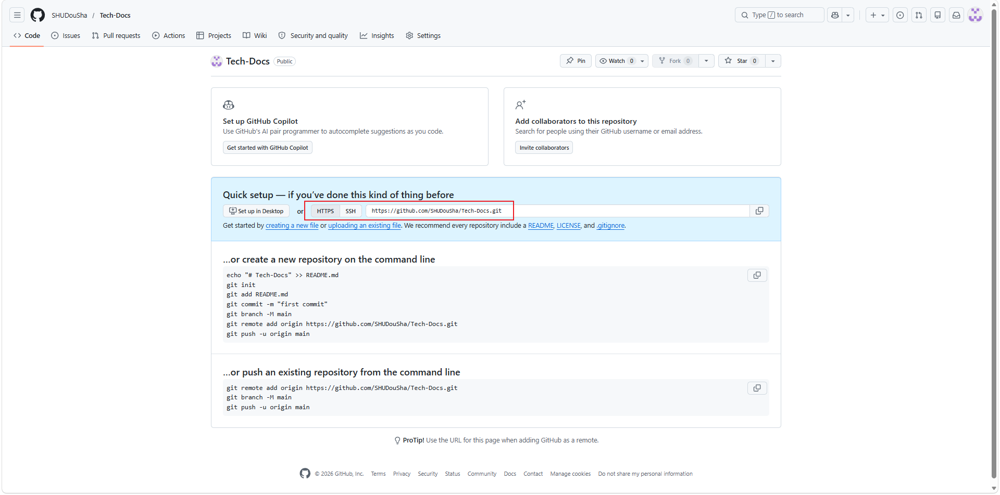

# 使用Visual Studio Code和Git进行开发

Markdown写作风格参考：[如何使用 PowerShell 文档](https://learn.microsoft.com/zh-cn/powershell/scripting/how-to-use-docs?view=powershell-7.6)

对于正文中的以下内容使用斜体：

- 特定指令语句

对于正文中的以下内容使用粗体：

- 按键

## 安装Visual Studio Code和Git

有关详细教学，请参阅[Link](https://www.bilibili.com/video/BV1Hkr7YYEh8/?spm_id_from=333.1391.0.0)。

1.安装 Visual Studio Code。

针对Windows平台的安装说明：

- [在Windows上运行Visual Studio Code](https://code.visualstudio.com/docs/setup/windows)

采用其中的Install with the Windows installer段落下的安装方式

采用默认安装即可，可以选择为桌面添加快捷方式

2.安装Git。

针对各个平台的安装说明：

- [起步 - 安装 Git](https://git-scm.com/book/zh/v2/起步-安装-Git)

在对应的Windows选项卡下选择最上方的**Click here to download**即可

 安装过程中将默认编辑器选择为Visual Studio Code，并选择Override the default branch name for new repositories其余默认即可

3.检验

安装好后，可以在Visual Studio Code下新建终端，输入以下命令检测Git是否安装成功：

```
$git -v
```

## 配置Git的用户名以及邮箱以及SSH

在[1.6 起步 - 初次运行 Git 前的配置](https://git-scm.com/book/zh/v2/起步-初次运行-Git-前的配置)中提到：

“安装完 Git 之后，要做的第一件事就是设置你的用户名和邮件地址。 这一点很重要，因为每一个 Git 提交都会使用这些信息，它们会写入到你的每一次提交中，不可更改”

其中的字段John Doe在任意Github界面点击右上角头像，进入Profile页面可以查看。

邮箱为注册Github账号时使用的邮箱。

```
$git config --global user.name "John Doe"
$git config --global user.email johndoe@example.com
```

配置完成后，可以通过以下命令检查：

```
# 查看用户名
$git config --global user.name

# 查看邮箱
$git config --global user.email

# 查看所有全局配置
$git config --global --list
```

随后对SSH进行配置。在命令行输入以下命令：

```
$ssh-keygen -t rsa -C "1684402635@qq.com"
```



登录github，按照下图流程然后打开SSH keys界面。点击**New SSH key**新增一条SSH keys。在信息窗口把前面命令生成的密钥文件id-rsa.pub里面的数据复制进去，保存即可。





输入以下命令进行测试：

```
ssh -T git@github.com
```

结果示例：

> E:\Tech-Docs>ssh -T git@github.com
> Hi SHUDouSha! You've successfully authenticated, but GitHub does not provide shell access.

## 初始化本地仓库并推送到远程

在本地创建了 `E:/Tech-Docs` 文件夹，并在 GitHub 上创建了一个名为 `Tech-Docs` 的空远程仓库。现在需要将这个本地文件夹初始化为 Git 仓库，并与 GitHub 远程仓库关联，最后将本地内容推送到远程。

### 进入本地文件夹

打开终端或命令提示符，导航到存放文档的本地文件夹：

```
cd E:/Tech-Docs
```

### 初始化本地仓库

在本地文件夹中初始化 Git 仓库。执行后，该文件夹中会生成一个 `.git` 隐藏文件夹，用于存储版本历史：

```
$git init
```

### 添加远程仓库地址

将本地仓库与 GitHub 上的远程仓库关联。远程仓库的地址需要在对应仓库下查看。



```
$git remote add origin git@github.com:SHUDouSha/Tech-Docs.git
```

在执行 `git remote add` 配置远程仓库后，可以通过以下命令查看当前仓库已关联的远程地址：

```
git remote -v
```

**输出示例：**

```
origin  git@github.com:SHUDouSha/Tech-Docs.git (fetch)
origin  git@github.com:SHUDouSha/Tech-Docs.git (push)
```

`-v` 是 `--verbose` 的缩写，会显示远程仓库的名称和对应的地址。`fetch` 表示拉取地址，`push` 表示推送地址，两者通常相同。

一个本地仓库完全可以关联多个远程仓库，假设本地仓库 Tech-Docs 同时关联 GitHub 和 Gitee：

```
# 关联 GitHub（命名为 origin）
git remote add origin https://github.com/你的用户名/Tech-Docs.git

# 关联 Gitee（命名为 gitee）
git remote add gitee https://gitee.com/你的用户名/Tech-Docs.git
```

使用`git remote -v`命令则会显示：

```
origin  https://github.com/你的用户名/Tech-Docs.git (fetch)
origin  https://github.com/你的用户名/Tech-Docs.git (push)
gitee   https://gitee.com/你的用户名/Tech-Docs.git (fetch)
gitee   https://gitee.com/你的用户名/Tech-Docs.git (push)
```

还可以通过以下命令，解除和某个远程仓库的关联。

```
# origin为远程仓库名
$git remote remove origin
```

### 添加文件到暂存区

将本地文件夹中的所有文件添加到 Git 的暂存区，准备提交：

```
git add .
```

`.` 表示当前目录下的所有文件。如果只想添加特定文件，可将 `.` 替换为文件路径，例如 `git add E:/Tech-Docs/README.md`。

### 提交到本地仓库

将暂存区的内容提交到本地仓库，并附上提交说明：

```
git commit -m "first commit"
```

提交说明应简洁明了，建议使用中文或英文保持一致。例如：`"首次提交"` 或 `"Initial commit"`。

### 推送到远程仓库

将本地仓库的内容推送到 GitHub 远程仓库。`-u` 参数用于将本地 `main` 分支与远程 `main` 分支关联，后续推送可直接使用 `git push`：

```
git push -u origin main
```

**如果默认分支是 `master`：**

```
git push -u origin master
```

### 验证推送是否成功

推送完成后，刷新 GitHub 上的远程仓库页面，应该能看到本地的所有文件已显示在仓库中。

