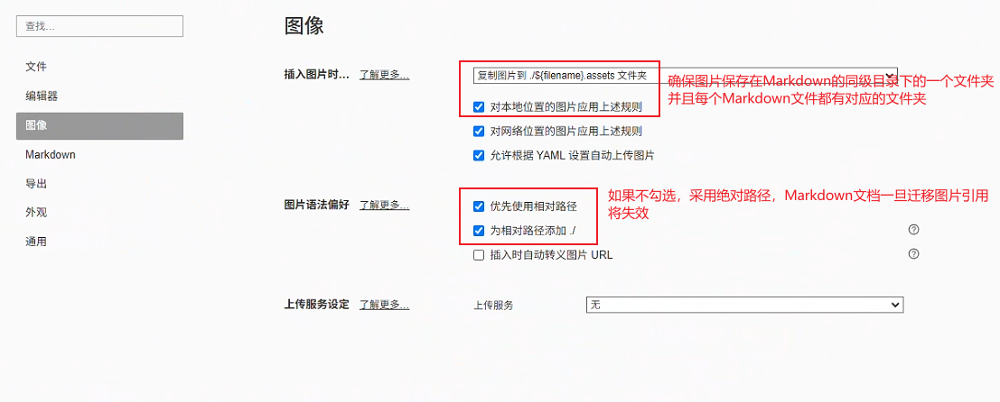
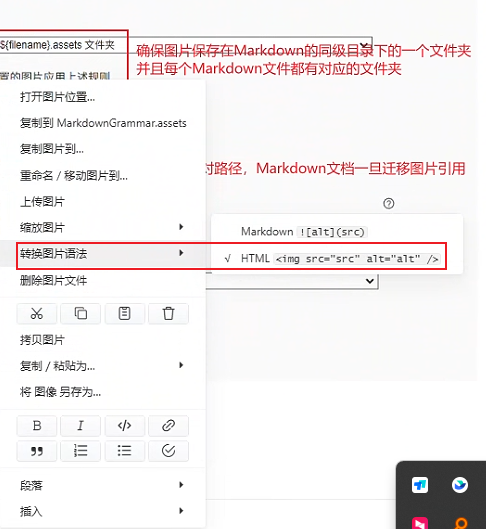

# Typora入门与Markdown语法

## Typora的相关设置

### 图片保存设置

在Typora中，可通过复制粘贴的方式导入图片。

需要在**偏好设置**中调整图片保存的方式以及路径。

主要需要做出以下几个调整：



由于对图片有缩放，对其等进一步调整的要求，我们需要做出调整采用HTML语法：



对于如何调整缩放以及对齐请询问Deepseek。

## Markdown语法

### 标题

创建标题，请在单词或短语前面添加井号 (`#`) 。`#` 的数量代表了标题的级别。例如，添加三个 `#` 表示创建一个三级标题

不同的 Markdown 应用程序处理 `#` 和标题之间的空格方式并不一致。为了兼容考虑，请用一个空格在 `#` 和标题之间进行分隔。

还可以在文本下方添加 -- 号来给标题添加下划线（注意，手动添加的此下划线会比较粗）。

一级#二级##标题自带的下划线会比较细

一级标题一般采用文件名或基于文件名做修改

二级三级标题看情况使用

二级三级之后的分段可以采用粗体代替

### 段落

要创建段落，请使用空白行将一行或多行文本进行分隔。

不要用空格（spaces）或制表符（ tabs）缩进段落。

### 换行

针对Typora编辑器，直接使用日常回车换行即可

### 强调

通过将文本设置为粗体或斜体来强调其重要性。

**粗体**

要加粗文本，请在单词或短语的前后各添加两个星号**（asterisks）

如需加粗一个单词或短语的中间部分用以表示强调的话，请在要加粗部分的两侧各添加两个星号**（asterisks）。中间不要带空格。

##### **斜体**

要用斜体显示文本，请在单词或短语前后添加一个星号*（asterisk）。要斜体突出单词的中间部分，请在字母前后各添加一个星号，中间不要带空格。

**粗体+斜体**

要同时用粗体和斜体突出显示文本，请在单词或短语的前后各添加三个星号***。要加粗并用斜体显示单词或短语的中间部分，请在要突出显示的部分前后各添加三个星号，中间不要带空格。

### 引用

要创建块引用，请在段落前添加一个 `>` 符号。

> 这是引用的效果示例

### 列表

主要使用无序列表即可

要创建无序列表，请在每个列表项前面添加破折号 (-)。缩进一个或多个列表项可创建嵌套列表。

- 这是无序列表示例

此外，Markdown还提供了二级三级列表

在一级无序列表一行结束按回车，在第二行按Tab可以创建二级无序列表，以此类推

- 这是一级无序列表
  - 这是二级无序列表
    - 这是三级无序列表

### 代码

要将单词或短语表示为代码，请将其包裹在反引号 (`) 中。

`这是单行代码示例`

在代码块之前和之后的行上使用三个反引号（```）

```
这是代码块示例
第一行
第二行
```

### 链接

链接文本放在中括号内，链接地址放在后面的括号中.

超链接Markdown语法代码：`[超链接显示名](超链接地址)`

可以采用省去http前缀的方式作为超链接显示名 

### Emoji

在描述部分文件结构层级时，可能需要使用到Emoji辅助

在windows系统中，使用win+.快捷键可以调出Emoji输入面板

### 参考文章链接

[markdown.com.cn/basic-syntax/links.html](https://markdown.com.cn/basic-syntax/links.html)


## Markdown写作参考

这是微软的开发文档[使用 Visual Studio Code 进行 PowerShell 开发](https://learn.microsoft.com/zh-cn/powershell/scripting/dev-cross-plat/vscode/using-vscode?view=powershell-7.6)


